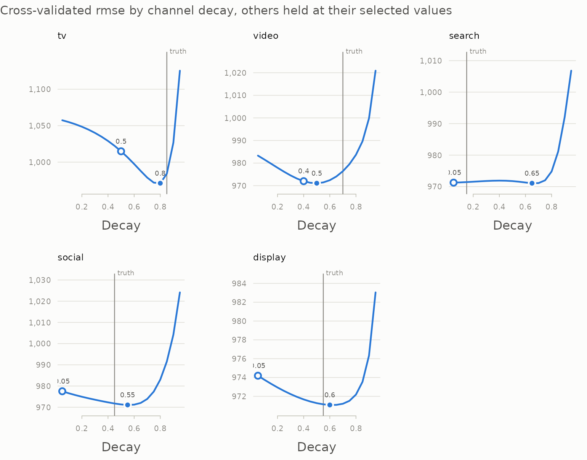
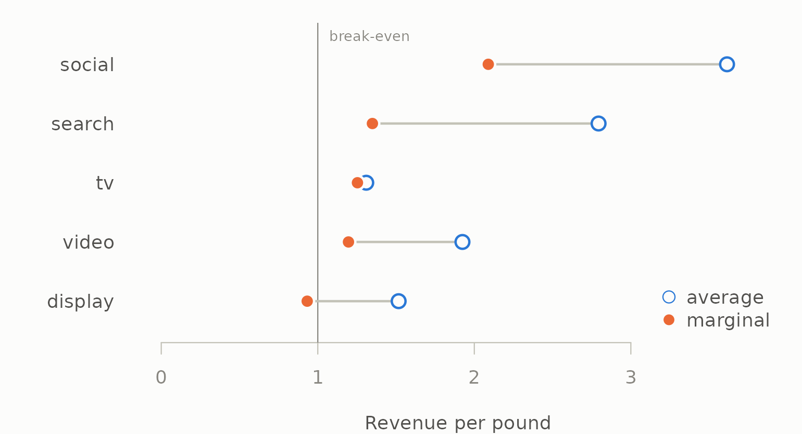
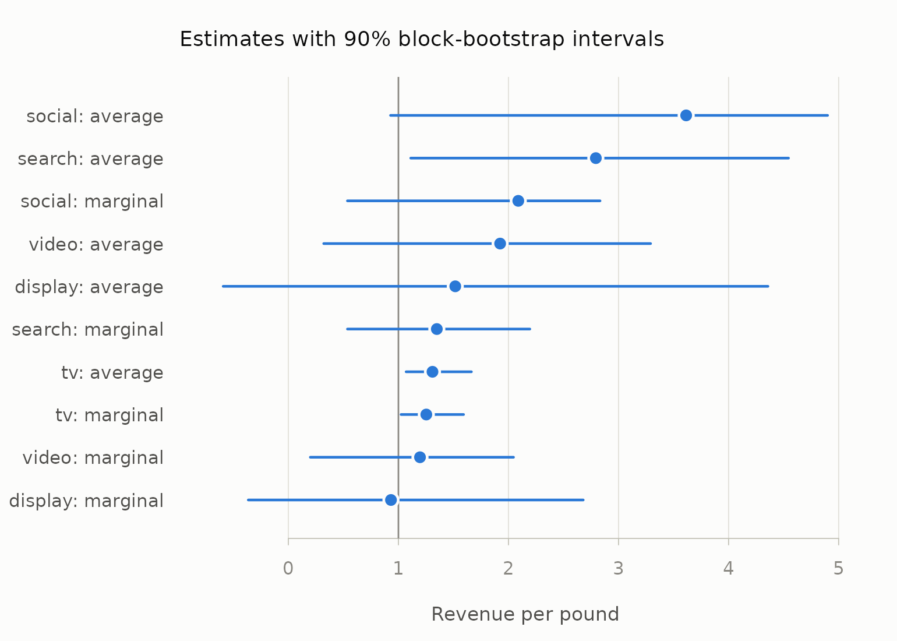

# Walkthrough: from weekly spend to a budget recommendation

This article follows one question from raw data to an answer: **if the
marketing budget stays the same, should any of it move between
channels?** It uses the north geography of `mm_weekly`, 156 weeks of
five channels, generated from known parameters so that every step can be
checked against the truth.

The getting-started vignette introduces each function. This article is
about using them together, and about where the answer is solid and where
it is not.

``` r

library(mediamix)
data(mm_weekly)

channels <- c("tv", "video", "search", "social", "display")
truth <- attr(mm_weekly, "truth")
north <- mm_weekly[mm_weekly$geo == "north", ]
north <- north[order(north$date), ]
north$week <- seq_len(nrow(north))
```

## 1. Check the data can answer the question

``` r

d <- diagnose_media(north, media = channels, decay = 0.6)
d
#> 
#> ── Media diagnostics
#> 156 observations across 1 series, 5 channels
#> Collinearity measured on adstocked media.
#> Ungrouped. On panel data, pass `by` so that collinearity is measured within
#> series.
#> ✔ No structural problems found.
#> 
#> Inspect $variation, $collinearity, $correlations.
d$collinearity[, c("channel", "vif", "most_correlated_with", "correlation")]
#>   channel   vif most_correlated_with correlation
#> 1  search 1.188                   tv      0.3173
#> 2      tv 1.176               search      0.3173
#> 3  social 1.169              display      0.2801
#> 4 display 1.148               social      0.2801
#> 5   video 1.076              display      0.1451
```

`decay = 0.6` measures collinearity after a representative adstock,
since smoothed series correlate more than raw spend and the model sees
the smoothed ones. No channel is collinear enough to make its
coefficient meaningless, and every one varies. Video and display are
dark in a third or more of weeks, so they carry less information than
their row count suggests — worth remembering when their numbers come
out.

## 2. Carryover: how well does the data identify it?

Tune every channel’s carryover at once, in one model that also holds the
controls, so no channel is credited with another’s effect or with the
trend:

``` r

controls <- north[c("week", "price", "seasonality", "holiday")]
grid <- seq(0.05, 0.95, by = 0.05)

joint <- tune_carryover_joint(north[channels], north$revenue,
                              controls = controls, decays = grid)
rbind(truth  = truth$decay[channels],
      best   = joint$best$decay,
      one_se = joint$best_1se$decay)
#>          tv video search social display
#> truth  0.85   0.7   0.15   0.45    0.55
#> best   0.80   0.5   0.65   0.55    0.60
#> one_se 0.50   0.4   0.05   0.05    0.05
```

``` r

plot(joint, truth = truth$decay)
```



Television, social and display land within 0.1 of the truth and video
within 0.2. Search does not, and its profile says why: it is nearly
flat, so the data holds almost no information about search’s carryover.
The one-standard-error choice falls back to a short carryover, which is
both the conservative claim and, here, close to right.

The joint search does not tune saturation. To keep this walkthrough
about the *decision* rather than the estimation, the rest of it uses the
generating parameters — what a full joint search over carryover *and*
saturation, as in
[`vignette("tidymodels")`](https://elkronos.github.io/mediamix/articles/tidymodels.md),
is trying to reach. Section 7 comes back to what happens when
television’s carryover is uncertain.

## 3. Fit the model

``` r

spec <- lapply(channels, function(ch) list(
  adstock = list(decay = truth$decay[[ch]]),
  saturation = list(half_max = truth$half_max[[ch]],
                    shape = truth$shape[[ch]])
))
names(spec) <- channels

transform_plan <- function(plan, spec) {
  as.data.frame(lapply(stats::setNames(channels, channels), function(ch) {
    media_transform(plan[[ch]], adstock = spec[[ch]]$adstock,
                    saturation = spec[[ch]]$saturation)
  }))
}

media <- transform_plan(north, spec)
model_data <- cbind(media, controls)
fit <- lm(north$revenue ~ ., data = model_data)
round(rbind(estimate = coef(fit)[channels], truth = truth$beta[channels]))
#>            tv video search social display
#> estimate 6013  1885   2622   2258     760
#> truth    5200  2400   4100   1800     900
```

## 4. Where did the revenue come from?

``` r

contrib <- contributions(media, fit, index = north$date)
avg <- roi(contrib, north[channels])
avg
#>   channel contribution  spend   roi
#> 1  social       132709  36716 3.614
#> 2  search       208307  74560 2.794
#> 3   video       102461  53248 1.924
#> 4 display        40853  26937 1.517
#> 5      tv       349629 266978 1.310
```

Every channel returns more than it costs on average. On this table alone
the tempting move is to take money from television, the lowest average
ROI, and give it to social, the highest.

## 5. What would the next pound do?

Average ROI describes the budget that was spent. The reallocation
question is about the *margin*, and
[`marginal_roi()`](https://elkronos.github.io/mediamix/reference/marginal_roi.md)
answers it by re-running the whole transform on a slightly larger
budget:

``` r

marginal <- do.call(rbind, lapply(channels, function(ch) {
  cbind(channel = ch, marginal_roi(
    north[[ch]], coefficient = coef(fit)[[ch]],
    adstock = spec[[ch]]$adstock, saturation = spec[[ch]]$saturation
  ))
}))
marginal <- merge(marginal[, c("channel", "mroi")],
                  avg[, c("channel", "roi", "spend")], by = "channel")
marginal[order(-marginal$mroi), ]
#>   channel   mroi   roi  spend
#> 3  social 2.0892 3.614  36716
#> 2  search 1.3490 2.794  74560
#> 4      tv 1.2534 1.310 266978
#> 5   video 1.1961 1.924  53248
#> 1 display 0.9324 1.517  26937
```

The ranking changes. Social still has the highest marginal return, but
television is no longer at the bottom: its S-shaped response means its
next pound works nearly as hard as its average one. Display is now last,
and its marginal return is below 1 — the last pounds spent on it did not
pay for themselves.

``` r

ink <- mm_palette(role = "ink")
cols <- mm_palette(2)
o <- marginal[order(marginal$mroi), ]
op <- par(mar = c(4, 6, 1, 1), bg = ink[["surface"]], fg = ink[["axis"]])
plot(NA, xlim = c(0, max(o$roi) * 1.05), ylim = c(0.5, nrow(o) + 0.5),
     yaxt = "n", bty = "n", xlab = "Revenue per pound", ylab = "",
     col.axis = ink[["muted"]], col.lab = ink[["secondary"]])
axis(2, at = seq_len(nrow(o)), labels = o$channel, las = 1, lwd = 0,
     col.axis = ink[["secondary"]])
abline(v = 1, col = ink[["muted"]])
text(1, nrow(o) + 0.45, "break-even", pos = 4, cex = 0.75, col = ink[["muted"]])
segments(o$mroi, seq_len(nrow(o)), o$roi, seq_len(nrow(o)),
         col = ink[["axis"]], lwd = 2)
points(o$roi, seq_len(nrow(o)), pch = 21, bg = ink[["surface"]], col = cols[1],
       cex = 1.6, lwd = 2)
points(o$mroi, seq_len(nrow(o)), pch = 21, bg = cols[2],
       col = ink[["surface"]], cex = 1.6, lwd = 2)
legend("bottomright", c("average", "marginal"), pch = 21,
       pt.bg = c(ink[["surface"]], cols[2]), col = c(cols[1], ink[["surface"]]),
       pt.cex = 1.4, bty = "n", text.col = ink[["secondary"]])
```



``` r

par(op)
```

So the candidate move is *display to social*, not *television to
social*.

## 6. How sure are we?

Every number so far is a point estimate from one sample of 156 weeks. A
block bootstrap resamples runs of consecutive weeks, refits the model,
and recomputes, which shows how much of the ranking survives sampling
noise. The transform is not re-run on the resampled rows — that would
glue unrelated weeks together and carry spend across the joins — so each
replicate refits the coefficients on resampled rows and recomputes
average and marginal return on the original spend plan:

``` r

boot_data <- cbind(revenue = north$revenue, media, controls)

returns <- function(d) {
  f <- lm(revenue ~ ., data = d)
  unlist(lapply(channels, function(ch) {
    r <- marginal_roi(north[[ch]], coefficient = coef(f)[[ch]],
                      adstock = spec[[ch]]$adstock,
                      saturation = spec[[ch]]$saturation)
    stats::setNames(c(r$roi, r$mroi),
                    paste(ch, c("average", "marginal"), sep = ": "))
  }))
}

boot <- block_bootstrap(boot_data, returns, times = 200, block_length = 13,
                        seed = 2026)
boot
#> 
#> ── Block bootstrap
#> 200 replicates, blocks of 13 rows, 90% percentile intervals
#>               term estimate   lower upper std_error
#>        tv: average   1.3096  1.0698 1.664    0.1924
#>       tv: marginal   1.2534  1.0240 1.592    0.1842
#>     video: average   1.9242  0.3211 3.291    0.9783
#>    video: marginal   1.1961  0.1996 2.046    0.6081
#>    search: average   2.7938  1.1118 4.545    1.0664
#>   search: marginal   1.3490  0.5368 2.194    0.5149
#>    social: average   3.6145  0.9283 4.900    1.2335
#>   social: marginal   2.0892  0.5365 2.832    0.7130
#>   display: average   1.5166 -0.5923 4.358    1.5145
#>  display: marginal   0.9324 -0.3642 2.679    0.9311
```

``` r

plot(boot, reference = 1, xlab = "Revenue per pound")
```



The intervals are wide. Only television’s returns are clearly above
break-even; every other channel’s interval crosses 1, and display’s
reaches below zero. Two channels’ intervals overlapping does not settle
a comparison between them, though — their estimates move together from
replicate to replicate — so ask the paired question directly:

``` r

reps <- attr(boot, "replicates")
c(social_beats_display = mean(reps[, "social: marginal"] >
                                reps[, "display: marginal"]),
  social_beats_tv      = mean(reps[, "social: marginal"] >
                                reps[, "tv: marginal"]))
#> social_beats_display      social_beats_tv 
#>                 0.72                 0.80
```

That is the honest strength of the evidence for moving money into
social: more likely right than wrong, and not more than that. It is a
reason to run the move as a test, not to announce it.

## 7. Test the move before recommending it

A marginal return is a derivative. A real reallocation is a finite
change, and the response curves bend along the way, so simulate the new
plan through the model rather than multiplying by a marginal rate.
Everything except the two channels is held fixed, and the controls do
not change, so the difference in predicted revenue is the difference in
media response:

``` r

media_revenue <- function(plan, spec) {
  m <- transform_plan(plan, spec)
  sum(vapply(channels, function(ch) coef(fit)[[ch]] * sum(m[[ch]]),
             numeric(1)))
}

# Move an amount of budget from one channel to another. Each channel's
# flighting pattern is kept: the change is spread over its weeks in
# proportion to its existing spend.
move <- function(from, to, amount, spec) {
  plan <- north
  plan[[from]] <- plan[[from]] * (1 - amount / sum(plan[[from]]))
  plan[[to]] <- plan[[to]] + amount * plan[[to]] / sum(plan[[to]])
  gain <- media_revenue(plan, spec) - media_revenue(north, spec)
  c(moved = amount, revenue_change = gain, per_pound_moved = gain / amount)
}

tenth <- 0.10 * sum(north$display)
rbind(
  `display -> social` = move("display", "social", tenth, spec),
  `tv -> social`      = move("tv", "social", tenth, spec),
  `display -> social, 2.5x` = move("display", "social", 2.5 * tenth, spec)
)
#>                         moved revenue_change per_pound_moved
#> display -> social        2694           2871          1.0659
#> tv -> social             2694           2090          0.7760
#> display -> social, 2.5x  6734           6213          0.9226
```

Moving a tenth of display’s budget into social raises predicted revenue
at no extra cost. Moving the *same amount* out of television instead —
the move the average-ROI table suggested — gains less, because it gives
up television’s still-steep response. Moving two and a half times as
much out of display gains more in total but less per pound, as social
climbs its own curve.

Two checks before this goes in a deck. First, is the new plan inside the
data?

``` r

peak <- function(amount) max(north$social + amount * north$social /
                               sum(north$social))
c(observed = max(north$social), smaller_move = peak(tenth),
  larger_move = peak(2.5 * tenth))
#>     observed smaller_move  larger_move 
#>        652.0        699.8        771.6
```

Both moves push social’s busiest week above anything in the data: the
smaller by about 7%, the larger by about 18%. A little beyond the
observed range is the unavoidable price of asking what *more* would do,
but the further out a plan goes, the more of its predicted gain is the
fitted curve’s shape rather than evidence. The smaller move stays close
enough to the data to be worth testing; the larger one should wait for
that test.

Second, how sensitive is the answer to carryover it could not pin down?
In section 2 the data was consistent with a television decay as low as
the one-SE value. Refit with that and ask again:

``` r

tv_alt <- joint$best_1se$decay[joint$best_1se$channel == "tv"]
spec_alt <- spec
spec_alt$tv$adstock$decay <- tv_alt

media_alt <- transform_plan(north, spec_alt)
fit_alt <- lm(north$revenue ~ ., data = cbind(media_alt, controls))

c(tv_decay = tv_alt,
  tv_mroi_truth = marginal$mroi[marginal$channel == "tv"],
  tv_mroi_alt = marginal_roi(
    north$tv, coefficient = coef(fit_alt)[["tv"]],
    adstock = spec_alt$tv$adstock, saturation = spec_alt$tv$saturation
  )$mroi)
#>      tv_decay tv_mroi_truth   tv_mroi_alt 
#>        0.5000        1.2534        0.6494
```

Television’s marginal return depends heavily on a carryover the data
only loosely identifies: at the shorter decay its next pound no longer
pays for itself. The display-to-social move does not involve television,
which is one more reason to prefer it — it is the recommendation that
survives the uncertainty. Whether television is over- or under-funded is
a question this data cannot settle, and saying so is part of the answer.

## 8. What to say, and what not to

The recommendation this analysis supports is modest and specific: *move
around a tenth of display’s budget into social as a test, leave
television alone until its carryover is better measured, and scale the
move only if the test confirms it.* The bootstrap in section 6 is why
the word “test” is not optional. Every number here rests on a model
fitted to observational data; a geo experiment — run the new allocation
in one region and compare — turns the model’s prediction into a
measurement, and its result can then be used to calibrate the model’s
priors or constraints.

What this analysis does not support: a precise revenue forecast for the
new plan, any move that takes a channel far outside the spend it has
historically run at, or a ranking of channels by average ROI.

## Where next

- [`vignette("tidymodels")`](https://elkronos.github.io/mediamix/articles/tidymodels.md)
  to tune every channel’s carryover and saturation jointly rather than
  one at a time.
- [`vignette("carryover")`](https://elkronos.github.io/mediamix/articles/carryover.md)
  for why one-at-a-time tuning goes wrong.
- [Methods and
  references](https://elkronos.github.io/mediamix/articles/methodology.md)
  for the research behind each step.
