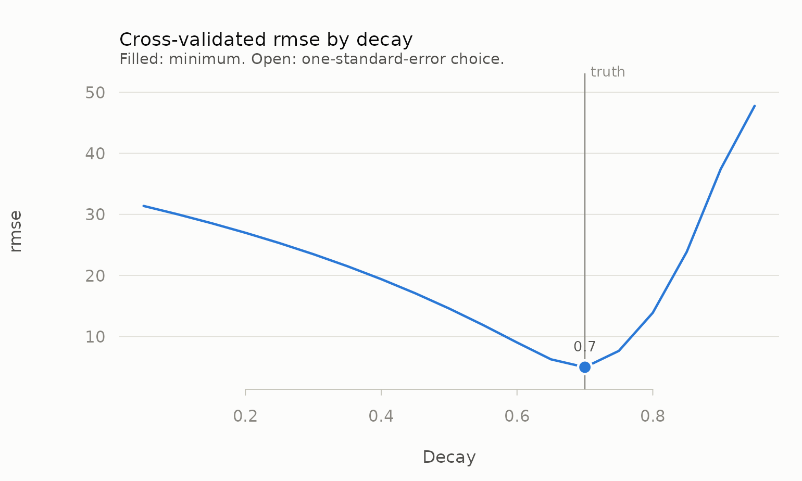
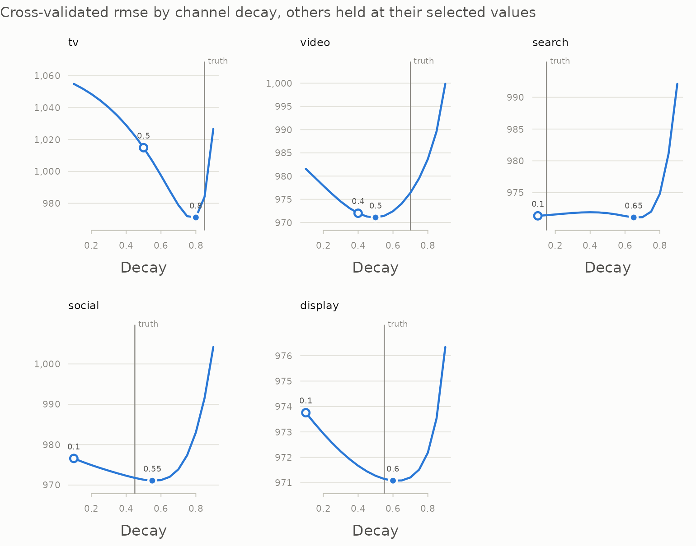

# Choosing carryover parameters

Decay and lag have to come from somewhere. Priors and vendor benchmarks
are one answer. Cross-validation is another, and it has the advantage of
being checkable: if the procedure works, it should recover a decay you
planted in simulated data.

This vignette is about doing that correctly, because there is a tempting
way to do it that does not work.

``` r

library(mediamix)
```

## The objective that does not work

Here is a plausible-sounding procedure. Adstock the media series, fit a
linear trend to the transformed series, extrapolate it one period ahead,
and score it against the raw series. Grid-search decay and lag; take the
best.

It sounds reasonable and it is broken, for a reason that is easy to
miss: **there is no dependent variable anywhere in that loop.** The
criterion never sees the KPI. It scores how *smooth and trend-like* the
transformed media series is, which is a property of the filter, not
evidence about the media.

Watch what it does on data where the true decay is 0.7:

``` r

set.seed(42)
n <- 156
spend <- pmax(0, rnorm(n, 500, 250))
truth <- 0.7
kpi <- 200 + 0.5 * adstock_geometric(spend, decay = truth) + rnorm(n, sd = 5)

no_kpi_objective <- function(x, max_lag, decay) {
  z <- adstock_geometric(x, decay, max_lag = max_lag)
  errs <- vapply(78:(n - 1), function(e) {
    m <- lm(z[1:e] ~ seq_len(e))
    (x[e + 1] - (coef(m)[1] + coef(m)[2] * (e + 1)))^2
  }, numeric(1))
  sqrt(mean(errs))
}

g <- expand.grid(max_lag = c(2, 5, 10, 20), decay = c(0.1, 0.5, 0.9))
g$error <- mapply(function(l, d) no_kpi_objective(spend, l, d),
                  g$max_lag, g$decay)
g[order(g$error), ]
#>    max_lag decay error
#> 1        2   0.1 232.6
#> 2        5   0.1 232.6
#> 3       10   0.1 232.6
#> 4       20   0.1 232.6
#> 5        2   0.5 232.7
#> 9        2   0.9 232.8
#> 6        5   0.5 233.1
#> 7       10   0.5 233.2
#> 8       20   0.5 233.2
#> 10       5   0.9 234.1
#> 11      10   0.9 236.7
#> 12      20   0.9 241.7
```

Two things are wrong here. The chosen decay is 0.1 against a truth of
0.7. And look at how little separates the contenders:

``` r

c(spread_across_whole_grid = max(g$error) / min(g$error) - 1,
  spread_across_best_four = sort(g$error)[4] / min(g$error) - 1)
#> spread_across_whole_grid  spread_across_best_four 
#>                3.944e-02                5.913e-05
```

The four best cells differ in the fifth significant figure, and the
whole grid spans under 4%. There is almost no signal to select on, and
what signal there is runs in a single direction: error rises
monotonically with decay, because a harder-smoothed series is a worse
predictor of a noisy raw one. The criterion is ranking filters by how
much they smooth. It never sees the KPI, so it cannot rank them by
anything else.

## Putting the KPI in the loop

[`tune_carryover()`](https://elkronos.github.io/mediamix/reference/tune_carryover.md)
scores each candidate `(max_lag, decay)` by how well a model fitted on
the adstocked media predicts *held-out KPI*:

``` r

tuned <- tune_carryover(
  spend, kpi,
  max_lags = Inf,
  decays = seq(0.05, 0.95, by = 0.05)
)
tuned
#> 
#> ── Carryover tuning
#> rolling_origin resampling, 78 splits, 19 grid points
#> Best: decay = 0.7 (half-life 1.94 periods), max_lag = infinite
#> rmse (pooled) = 4.95364, std. error 0.357
```

Recovered exactly. The profile shows how sharply the data identifies it
— a clear valley here, which is what a well-identified carryover looks
like:

``` r

plot(tuned, truth = truth)
```



And it is not a fluke of one decay value:

``` r

recover <- function(true_decay, seed = 1) {
  set.seed(seed)
  x <- pmax(0, rnorm(n, 500, 250))
  y <- 200 + 0.5 * adstock_geometric(x, decay = true_decay) + rnorm(n, sd = 5)
  t <- suppressWarnings(tune_carryover(
    x, y, max_lags = Inf, decays = seq(0.05, 0.95, by = 0.05)))
  c(true = true_decay, recovered = t$best$decay,
    true_hl = half_life(true_decay), recovered_hl = t$best$half_life)
}

round(t(vapply(c(0.2, 0.35, 0.5, 0.7, 0.85), recover, numeric(4))), 3)
#>      true recovered true_hl recovered_hl
#> [1,] 0.20      0.20   0.431        0.431
#> [2,] 0.35      0.35   0.660        0.660
#> [3,] 0.50      0.50   1.000        1.000
#> [4,] 0.70      0.70   1.943        1.943
#> [5,] 0.85      0.85   4.265        4.265
```

This recovery test lives in the package’s own test suite. It is the
check that the objective is measuring what it claims to.

## Why slicing a fully adstocked series is legitimate

[`tune_carryover()`](https://elkronos.github.io/mediamix/reference/tune_carryover.md)
adstocks the whole series once per grid point and then cuts it into
folds, rather than re-adstocking inside each fold. That looks like
leakage and is not, because the filter is strictly causal:

``` r

z <- adstock_geometric(spend, decay = 0.7)
all.equal(z[1:40], adstock_geometric(spend[1:40], decay = 0.7))
#> [1] TRUE
all.equal(z[1:100], adstock_geometric(spend[1:100], decay = 0.7))
#> [1] TRUE
```

The adstock value at time *t* depends only on media at times ≤ *t*. So
an assessment period’s regressor draws on training-period *media* —
information genuinely available at prediction time — and never on future
media. No KPI information crosses the boundary at any point. The package
tests this invariant explicitly, precisely because the shortcut depends
on it.

## A correct objective is not the same as an easy problem

Everything above uses a single channel with no confounders. Real data is
not like that, and it is worth seeing how much harder it gets before
trusting a number.

`mm_weekly` has five correlated, flighted channels, a price term, a
trend and seasonality, and 156 weekly observations. Tune each channel’s
decay one at a time against raw revenue, and:

``` r

data(mm_weekly)
north <- mm_weekly[mm_weekly$geo == "north", ]
truth_params <- attr(mm_weekly, "truth")
grid <- seq(0.1, 0.9, by = 0.05)

channels <- names(truth_params$decay)

one_at_a_time <- vapply(channels, function(ch) {
  suppressWarnings(tune_carryover(north[[ch]], north$revenue,
                                  max_lags = Inf, decays = grid))$best$decay
}, numeric(1))

rbind(true = truth_params$decay[channels], recovered = one_at_a_time)
#>             tv video search social display
#> true      0.85  0.70   0.15   0.45    0.55
#> recovered 0.80  0.25   0.35   0.10    0.45
```

Some are close, some are badly off. Nothing is wrong with the objective
— it recovered five out of five true decays a moment ago. The problem is
the *model* it is being evaluated against: a univariate regression of
revenue on one adstocked channel, with no controls and no saturation.
That model attributes the trend, the price effect, seasonality and the
other four channels’ work to whichever channel it is currently looking
at, and the carryover that best predicts under those conditions is not
the true one.

Residualising the KPI against the controls first helps, but not enough:

``` r

base <- lm(revenue ~ seq_len(nrow(north)) + price + seasonality + holiday,
           data = north)

residualised <- vapply(channels, function(ch) {
  suppressWarnings(tune_carryover(north[[ch]], residuals(base),
                                  max_lags = Inf, decays = grid))$best$decay
}, numeric(1))

rbind(true = truth_params$decay[channels],
      raw_kpi = one_at_a_time,
      residualised = residualised)
#>                tv video search social display
#> true         0.85  0.70   0.15   0.45    0.55
#> raw_kpi      0.80  0.25   0.35   0.10    0.45
#> residualised 0.85  0.40   0.30   0.10    0.45
```

The lesson is not that cross-validation fails. It is that **carryover is
not separable from the rest of the specification**, so tuning it one
channel at a time against a model you do not intend to fit answers a
question you did not ask.

## Tuning every channel at once

[`tune_carryover_joint()`](https://elkronos.github.io/mediamix/reference/tune_carryover_joint.md)
puts all five channels and the controls into one model and chooses each
channel’s decay with the others’ effects accounted for. It searches by
coordinate descent — one channel at a time, holding the rest, repeating
until nothing moves — so it costs a few sweeps of the one-channel grid
rather than the full five-dimensional grid:

``` r

controls <- data.frame(week = seq_len(nrow(north)), price = north$price,
                       seasonality = north$seasonality,
                       holiday = north$holiday)

joint <- tune_carryover_joint(north[channels], north$revenue,
                              controls = controls, decays = grid)
joint
#> 
#> ── Joint carryover tuning
#> 5 channels, rolling_origin resampling, 78 splits; 3 sweeps, converged
#> rmse (pooled) = 971.083
#>  channel max_lag decay half_life decay_1se
#>       tv     Inf  0.80      3.11       0.5
#>    video     Inf  0.50      1.00       0.4
#>   search     Inf  0.65      1.61       0.1
#>   social     Inf  0.55      1.16       0.1
#>  display     Inf  0.60      1.36       0.1

rbind(true = truth_params$decay[channels],
      one_at_a_time = one_at_a_time,
      residualised = residualised,
      joint = joint$best$decay,
      joint_1se = joint$best_1se$decay)
#>                 tv video search social display
#> true          0.85  0.70   0.15   0.45    0.55
#> one_at_a_time 0.80  0.25   0.35   0.10    0.45
#> residualised  0.85  0.40   0.30   0.10    0.45
#> joint         0.80  0.50   0.65   0.55    0.60
#> joint_1se     0.50  0.40   0.10   0.10    0.10
```

Much closer, and the profiles show where the remaining doubt lies:

``` r

plot(joint, truth = truth_params$decay)
```



Television, video and social have clear valleys. Search’s profile barely
moves across the whole range: the data cannot tell a search half-life of
a fraction of a week from one of several, and the one-standard-error
choice falls back to the short end, near the truth. That flatness is
itself the finding, and a point estimate without the profile would hide
it.

The model here is still linear in adstocked media, with no saturation,
so it is not the model the data came from. For carryover tuned jointly
with saturation and a model penalty, use the recipe steps in
[`vignette("tidymodels")`](https://elkronos.github.io/mediamix/articles/tidymodels.md).

## Reading the result

``` r

head(tuned$results, 5)
#>   max_lag decay half_life metric std_err n_splits
#> 1     Inf  0.70     1.943  4.954  0.3569       78
#> 2     Inf  0.65     1.609  6.246  0.4035       78
#> 3     Inf  0.75     2.409  7.632  0.5700       78
#> 4     Inf  0.60     1.357  9.007  0.5957       78
#> 5     Inf  0.55     1.159 11.870  0.7785       78
```

The `results` grid is worth looking at rather than just taking `best`.
If the metric is nearly flat across a wide band of decay, the data does
not identify carryover tightly and a confident point estimate would be
overstating things.

Two things in the output help with that. `std_err` is the standard error
of the per-split errors, which says how far apart two candidates need to
be before the difference means anything. And `best_1se` applies the
one-standard-error rule (Breiman et al., 1984; Hastie, Tibshirani and
Friedman, 2009): the *shortest* carryover whose error is within one
standard error of the minimum.

``` r

rbind(best = tuned$best, one_se = tuned$best_1se)
#>        max_lag decay half_life metric std_err n_splits
#> best       Inf   0.7     1.943  4.954  0.3569       78
#> one_se     Inf   0.7     1.943  4.954  0.3569       78
```

When the two agree, the data has spoken clearly. When they do not, the
data cannot tell them apart, and the shorter carryover is the more
conservative claim to put in front of a client — a long carryover
flatters a channel by crediting it with sales weeks after it ran.

By default the metric is *pooled*: every out-of-sample forecast across
all splits is collected and `metric_fn` is evaluated once, so `rmse` is
the root mean squared forecast error. `aggregate = "mean"` averages a
per-split metric instead, which is the `tune` convention; with
one-period assessment sets that turns any RMSE into a mean absolute
error, because the RMSE of a single point is its absolute error.

[`tune_carryover()`](https://elkronos.github.io/mediamix/reference/tune_carryover.md)
warns when the winner is pinned to the edge of the grid:

``` r

narrow <- tune_carryover(spend, kpi, max_lags = Inf,
                         decays = seq(0.1, 0.5, by = 0.1))
#> Warning: The chosen parameters sit on the edge of the grid.
#> • The selected decay (0.5) is the largest value in `decays`.
#> ℹ Widen the grid and re-run. A parameter pinned to a boundary usually means the
#>   optimum is outside it, or that the series is too short to identify carryover
#>   this long.
narrow$best$decay
#> [1] 0.5
```

Here the truth is 0.7 and the grid stops at 0.5, so the optimum is
outside it. The warning is the signal to widen the grid rather than to
believe the answer.

## The start of the series

Adstock starts from zero unless told otherwise, as if no media had ever
run before the first week. For a slow channel that understates the early
weeks:

``` r

steady <- rep(100, 8)
rbind(cold = adstock_geometric(steady, decay = 0.85),
      warm = adstock_geometric(steady, decay = 0.85,
                               state = adstock_steady_state(steady, 0.85)))
#>      [,1]   [,2]   [,3]  [,4]   [,5]   [,6]   [,7]   [,8]
#> cold   15  27.75  38.59  47.8  55.63  62.29  67.94  72.75
#> warm  100 100.00 100.00 100.0 100.00 100.00 100.00 100.00
```

[`adstock_steady_state()`](https://elkronos.github.io/mediamix/reference/adstock_steady_state.md)
seeds the filter as though the early average spend had always been
running, and `warm_start = TRUE` applies it to every candidate in
[`tune_carryover()`](https://elkronos.github.io/mediamix/reference/tune_carryover.md)
and
[`tune_carryover_joint()`](https://elkronos.github.io/mediamix/reference/tune_carryover_joint.md).
Real pre-period spend, passed through
[`adstock_state()`](https://elkronos.github.io/mediamix/reference/adstock_state.md),
is better still when you have it.

## Sanity-check the answer against the data you have

``` r

window <- effective_window(tuned$best$decay, coverage = 0.90)
window
#> [1] 7
```

The selected decay of 0.7 implies 7 periods before 90% of a burst’s
effect has played out. Compare that against the series length: if the
effective window approaches a large fraction of it, the parameter is not
identified by the data no matter how confident the cross-validation
looks. Here 7 periods against 156 is comfortable.

## Resampling schemes

Both schemes are forward-only; neither ever trains on data that follows
what it assesses.

``` r

rolling <- tune_carryover(spend, kpi, max_lags = Inf,
                          decays = seq(0.5, 0.9, by = 0.1),
                          scheme = "rolling_origin")
kfold <- tune_carryover(spend, kpi, max_lags = Inf,
                        decays = seq(0.5, 0.9, by = 0.1),
                        scheme = "k_fold_forward", k = 5)
c(rolling = rolling$best$decay, k_fold = kfold$best$decay)
#> rolling  k_fold 
#>     0.7     0.7
```

`"rolling_origin"` grows the training window one period at a time and
gives many splits; `"k_fold_forward"` uses a handful of contiguous
forward blocks and is cheaper on long series.

For tuning carryover jointly with saturation and a model’s own penalty,
see
[`vignette("tidymodels")`](https://elkronos.github.io/mediamix/articles/tidymodels.md).

## References

Bergmeir, C. and Benítez, J. M. (2012). On the use of cross-validation
for time series predictor evaluation. *Information Sciences*, 191,
192–213.

Breiman, L., Friedman, J., Olshen, R. and Stone, C. (1984).
*Classification and Regression Trees*. Wadsworth.

Hastie, T., Tibshirani, R. and Friedman, J. (2009). *The Elements of
Statistical Learning* (2nd ed.). Springer.
