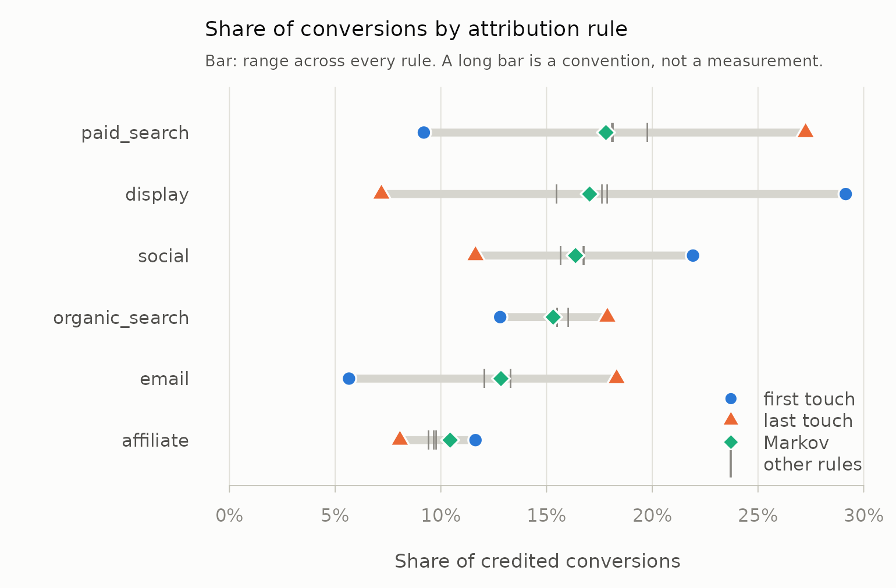

# Building journeys from event logs

Attribution packages consume journeys —
`"display > social > paid_search"` strings with conversion counts
attached. Producing those strings from a raw event log is usually left
to the analyst: `ChannelAttribution`, for instance, starts from the
aggregated paths, on the reasonable grounds that its job is Markov
removal effects and it does that in C++.

So the step gets done in analysis code, usually as a
[`group_by()`](https://dplyr.tidyverse.org/reference/group_by.html) and
a `paste(collapse = " > ")`. This vignette is about what that loses,
because the answer is not small and it feeds the transition matrix
directly.

``` r

library(mediamix)
data(mm_events)

nrow(mm_events)
#> [1] 20799
head(mm_events)
#>   customer_id        channel           timestamp conversion value
#> 1  cust_03227          email 2025-02-10 18:08:57          0    NA
#> 2  cust_03940                2025-05-20 04:44:17          0    NA
#> 3  cust_04838 organic_search 2025-04-04 22:20:01          0    NA
#> 4  cust_00749      affiliate 2025-09-27 03:31:38          0    NA
#> 5  cust_05340           <NA> 2025-02-24 22:17:01          0    NA
#> 6  cust_05271         social 2025-02-18 19:00:56          0    NA
```

`mm_events` is a synthetic log of about 21,000 touchpoint events across
5,400 customers. It contains, on purpose, everything a real export
contains: repeat converters, consecutive duplicate channels, direct and
blank and missing channel labels, customers who never convert, timestamp
ties, and rows in no particular order.

## The naive approach

One path per customer, in timestamp order:

``` r

ordered <- mm_events[order(mm_events$customer_id, mm_events$timestamp), ]
naive <- split(ordered$channel, ordered$customer_id)

c(journeys = length(naive), mean_length = mean(lengths(naive)))
#>    journeys mean_length 
#>    5400.000       3.852
```

5,400 journeys at a mean length of 3.85. Now the same log through
[`build_paths()`](https://elkronos.github.io/mediamix/reference/build_paths.md):

``` r

paths <- build_paths(
  mm_events,
  id = "customer_id",
  channel = "channel",
  timestamp = "timestamp",
  conversion = "conversion",
  value = "value"
)
path_summary(paths)
#>   events_in events_out journeys converting_journeys mean_length median_length
#> 1     20799      17306     6137                2741        2.82             3
#>   max_length direct_events conversion_events conversions_observed
#> 1          9          1597              2741                 2741
#>   conversions_unattributable
#> 1                          0
```

6,137 journeys — 14% more — at a mean length of 2.82, down 27%. Journey
counts and lengths feed a Markov transition matrix directly, so a 14%
error in the count and a 27% error in the length is not a rounding
difference in the final numbers.

Here is where the difference comes from, one concern at a time.

``` r

step <- function(...) {
  s <- path_summary(build_paths(
    mm_events, id = "customer_id", channel = "channel",
    timestamp = "timestamp", conversion = "conversion", ...))
  c(journeys = s$journeys, mean_length = round(s$mean_length, 2))
}

rbind(
  `naive`                       = c(length(naive), round(mean(lengths(naive)), 2)),
  `split on conversion`         = step(split_on = "conversion",
                                       collapse_repeats = FALSE),
  `+ 30-day inactivity gap`     = step(split_on = c("conversion", "gap"),
                                       gap = 30, collapse_repeats = FALSE),
  `+ collapse duplicates`       = step(split_on = c("conversion", "gap"),
                                       gap = 30, collapse_repeats = TRUE)
)
#>                         journeys mean_length
#> naive                       5400        3.85
#> split on conversion         6137        3.39
#> + 30-day inactivity gap     6158        3.38
#> + collapse duplicates       6158        2.81
```

## The seven things that go wrong

### 1. Journey splitting

A customer who converts in March and again in September is two journeys.
Treat them as one and March’s touchpoints take credit for September’s
sale, while the journey count falls by every repeat conversion in the
file.

``` r

repeat_buyers <- table(mm_events$customer_id[mm_events$conversion == 1])
table(as.integer(repeat_buyers))
#> 
#>    1    2    3 
#> 1509  349  178
```

`split_on` also accepts `"gap"`, so a customer who disappears for four
months and comes back starts a new journey rather than extending an
eleven-month one.

### 2. Lookback windows

A touch two years before a conversion did not cause it. Thirty, sixty
and ninety days are the standard choices, and they are standard because
everybody copied each other.

[`conversion_lag()`](https://elkronos.github.io/mediamix/reference/conversion_lag.md)
lets you read the window off your own data instead:

``` r

conversion_lag(paths)
#>   quantile     lag
#> 1     0.50   4.635
#> 2     0.75   8.957
#> 3     0.90  14.047
#> 4     0.95  17.427
#> 5     0.99  29.265
#> 6     1.00 135.453
```

Ninety per cent of journeys in this log complete within about fourteen
days, so a 30-day window truncates almost nothing and a 90-day window is
pure decoration. The long tail is real, though — the slowest journey
takes 135 days — so a window is a decision about which tail to discard,
not a free simplification. On a considered-purchase category the same
table will tell you the opposite, and reading it takes one line.

### 3. Non-converting journeys

These are kept by default, and you should think hard before changing
that.

``` r

with_nulls <- as_channel_paths(paths)
head(with_nulls, 4)
#>             path total_conversions total_null total_conversion_value
#> 1         social                97        106                  13120
#> 2 organic_search                81         91                   9013
#> 3    paid_search                81         74                  10658
#> 4        display                79        122                   9628
c(converting = sum(with_nulls$total_conversions),
  null = sum(with_nulls$total_null))
#> converting       null 
#>       2741       3396
```

Markov removal effects are computed *against* the null paths: the
transition matrix needs an absorbing failure state to compare the
conversion state with. Drop them and every channel’s estimated effect is
biased upward, silently.

### 4. Direct, none and missing channels

Every real log has them, and every tutorial handles them differently.

``` r

table(build_paths(mm_events, id = "customer_id", channel = "channel",
                  timestamp = "timestamp", conversion = "conversion",
                  direct = "label")$channel)
#> 
#>       (direct)      affiliate        display          email organic_search 
#>           1581           1737           3016           2182           2746 
#>    paid_search         social 
#>           3205           2823
```

`"keep"` leaves the labels alone (naming the unnamed ones so they can be
referred to at all), `"label"` folds them into one `"(direct)"` channel,
and `"drop"` removes those touches entirely. The choice moves the
numbers, so it is an argument rather than a default buried in the
source.

### 5. Accounting for what gets dropped

Dropping direct traffic can strip a converting journey of every
touchpoint it had — including, sometimes, the touch that recorded the
conversion. mediamix fixes the conversion facts before any filtering, so
the conversion is never erased; it is counted and reported as
unattributable.

``` r

dropped <- build_paths(
  mm_events, id = "customer_id", channel = "channel",
  timestamp = "timestamp", conversion = "conversion",
  lookback = 1, direct = "drop"
)
path_summary(dropped)[, c("conversions_observed", "converting_journeys",
                          "conversions_unattributable")]
#>   conversions_observed converting_journeys conversions_unattributable
#> 1                 2741                2538                        203
```

Those conversions happened. They just cannot be credited to any channel
under these settings, and a pipeline that quietly reports a smaller
denominator is lying by omission.

### 6. Consecutive duplicates

Three page views on the same channel are usually one exposure recorded
three times. Collapsing them is what takes the mean journey length from
3.38 to 2.81 in the table above. `collapse_repeats = TRUE` keeps the
*first* touch of each run, preserving when the channel entered the
journey — if you are using
[`credit_time_decay()`](https://elkronos.github.io/mediamix/reference/credit.md),
consider `FALSE`, since keeping the first of a run pushes each channel’s
apparent recency backward.

### 7. Deterministic ordering

Logs written at second resolution are full of ties.
[`build_paths()`](https://elkronos.github.io/mediamix/reference/build_paths.md)
breaks them by original row order, so the same input always gives the
same journeys — which matters because first-touch and last-touch results
are otherwise not reproducible.

## Assigning credit

Five rules, plus a hook for your own. Each returns the journey table
with a `credit` column, so they compose and compare.

``` r

lin <- credit_linear(paths)
head(lin[, c("path_id", "channel", "touch_rank", "touch_n", "credit")])
#>        path_id        channel touch_rank touch_n credit
#> 1 cust_00001#1 organic_search          1       1    1.0
#> 2 cust_00001#2        display          1       5    0.2
#> 3 cust_00001#2 organic_search          2       5    0.2
#> 4 cust_00001#2          email          3       5    0.2
#> 5 cust_00001#2         social          4       5    0.2
#> 6 cust_00001#2 organic_search          5       5    0.2
```

Credit sums to 1 within every converting journey, and total credit
equals the number of attributable conversions — the invariant that
catches journeys silently dropped in construction:

``` r

c(total_credit = sum(lin$credit),
  attributable = path_summary(paths)$converting_journeys)
#> total_credit attributable 
#>         2741         2741
```

[`attribute()`](https://elkronos.github.io/mediamix/reference/attribute.md)
runs several rules at once, which is the point:

``` r

res <- attribute(paths)
head(res, 8)
#>     rule        channel conversions   share value touches
#> 1 linear    paid_search      495.83 0.18089 63492    3205
#> 2 linear        display      482.87 0.17616 60332    3016
#> 3 linear         social      459.31 0.16757 59030    2823
#> 4 linear organic_search      424.84 0.15499 51259    2746
#> 5 linear          email      330.17 0.12046 42284    2182
#> 6 linear      affiliate      264.80 0.09661 33470    1737
#> 7 linear        (blank)       91.29 0.03330 11418     465
#> 8 linear         (none)       81.74 0.02982  9697     427
```

## The spread is the finding

Any single rule gives you a number. Several rules give you the range
that number could have been, which is more honest and usually more
useful:

``` r

attribution_spread(res)
#>           channel min_share max_share mean_share    spread first_last_ratio
#> 1         display   0.07187   0.29150    0.17388 0.2196279           4.0558
#> 2     paid_search   0.09194   0.27253    0.18376 0.1805910           0.3373
#> 3           email   0.05655   0.18314    0.12366 0.1265961           0.3088
#> 4          social   0.11638   0.21926    0.16513 0.1028822           1.8840
#> 5  organic_search   0.12806   0.17877    0.15501 0.0507114           0.7163
#> 6       affiliate   0.08063   0.11638    0.09828 0.0357534           1.4434
#> 7         (blank)   0.02919   0.03390    0.03171 0.0047183           0.9302
#> 8          direct   0.02225   0.02681    0.02404 0.0045596           1.0328
#> 9          (none)   0.02736   0.02982    0.02848 0.0024578           1.0133
#> 10      (missing)   0.01569   0.01642    0.01605 0.0007297           1.0465
```

The same table as a picture — each bar is the range a channel’s share
covers across all six rules:

``` r

plot(res, n = 6)
```



Display’s share runs from 7% to 29% depending only on the convention
chosen. That channel has not been measured; it has been assigned a
number. Paid search and email move the other way.
[`channel_positions()`](https://elkronos.github.io/mediamix/reference/channel_positions.md)
says why:

``` r

channel_positions(paths)
#>           channel only first middle last touches first_last_ratio
#> 9     paid_search   81   171    503  666    1421           0.2568
#> 6         display   79   720    437  118    1354           6.1017
#> 10         social   97   504    449  222    1272           2.2703
#> 8  organic_search   81   270    461  409    1221           0.6601
#> 7           email   46   109    364  456     975           0.2390
#> 4       affiliate   40   279    276  181     776           1.5414
#> 1         (blank)   27    53     80   59     219           0.8983
#> 3          (none)   19    57     72   56     204           1.0179
#> 5          direct   13    50     59   48     170           1.0417
#> 2       (missing)    9    36     32   34     111           1.0588
```

Display opens journeys — it appears first six times for every once it
appears last — while paid search and email close them. First-touch and
last-touch attribution therefore disagree about them by construction,
and reporting either one alone is choosing a side of that disagreement
without saying so.

Note that both tables carry a column called `first_last_ratio` and they
are not the same quantity. Here it is a ratio of touchpoint *counts*
(6.10 for display); in
[`attribution_spread()`](https://elkronos.github.io/mediamix/reference/attribution_spread.md)
above it is a ratio of credited *shares* (4.06). Both say display opens
journeys; they are measured in different currencies and will not agree
numerically.

The assist matrix is the other half of the picture:

``` r

real <- c("display", "social", "organic_search", "paid_search", "email")
round(assisted_conversions(paths, normalise = TRUE)[real, real], 3)
#>                 assisted
#> assisting        display social organic_search paid_search email
#>   display          0.101  0.258          0.318       0.415 0.304
#>   social           0.175  0.116          0.266       0.389 0.290
#>   organic_search   0.139  0.168          0.128       0.294 0.226
#>   paid_search      0.096  0.127          0.191       0.128 0.179
#>   email            0.089  0.128          0.167       0.250 0.068
```

Read a row as “this channel assisted these channels”. Display precedes
paid search in 42% of the converting journeys display appears in; paid
search precedes display in only 10% of its own. That asymmetry is the
same finding as the first-versus-last ratio, seen pairwise rather than
in aggregate.

## Time decay, and the connection to the other half

[`credit_time_decay()`](https://elkronos.github.io/mediamix/reference/credit.md)
spreads a conversion’s credit backward across prior touchpoints with
geometric decay — the same kernel
[`adstock_geometric()`](https://elkronos.github.io/mediamix/reference/adstock_geometric.md)
uses to spread spend forward, and the same `decay` vocabulary:

``` r

td <- credit_time_decay(paths, decay = decay_from_half_life(3))
example <- td[td$path_id == td$path_id[td$converted & td$touch_n >= 4][1], ]
example[, c("channel", "touch_rank", "time_to_conversion", "credit")]
#>          channel touch_rank time_to_conversion   credit
#> 2        display          1             16.525 0.009904
#> 3 organic_search          2              5.862 0.116358
#> 4          email          3              5.005 0.141849
#> 5         social          4              2.045 0.281075
#> 6 organic_search          5              0.000 0.450814
```

That symmetry is not a coincidence. See
[`vignette("spine")`](https://elkronos.github.io/mediamix/articles/spine.md).

## Data-driven attribution: Markov removal effects

The five rules above are conventions chosen in advance. The Markov model
of Anderl et al. (2016) lets the journeys choose instead: it fits a
transition matrix from start, through channels, to conversion or null,
and credits each channel by its *removal effect* — how much the
probability of converting falls when every transition into that channel
is sent to null instead.

[`markov_removal()`](https://elkronos.github.io/mediamix/reference/markov_removal.md)
fits the order-1 model exactly, from the absorbing-chain fundamental
matrix, in base R:

``` r

mk <- markov_removal(paths)
mk
#>           channel removal_effect conversions   share value
#> 1     paid_search        0.43654      488.15 0.17809 61389
#> 2         display        0.41762      466.99 0.17037 58728
#> 3          social        0.40124      448.68 0.16369 56426
#> 4  organic_search        0.37534      419.72 0.15313 52783
#> 5           email        0.31480      352.02 0.12843 44269
#> 6       affiliate        0.25588      286.13 0.10439 35984
#> 7         (blank)        0.07586       84.83 0.03095 10668
#> 8          (none)        0.06823       76.29 0.02783  9594
#> 9          direct        0.06573       73.50 0.02681  9243
#> 10      (missing)        0.03996       44.69 0.01630  5620
attr(mk, "p_conversion")
#> [1] 0.4466
```

The null paths are what make this work — they are how the model learns
how often a journey ends in nothing, which is why
[`build_paths()`](https://elkronos.github.io/mediamix/reference/build_paths.md)
keeps them by default.
[`attribute()`](https://elkronos.github.io/mediamix/reference/attribute.md)
includes it as the `"markov"` rule, so the spread table above already
had it in:

``` r

res[res$rule == "markov", c("channel", "conversions", "share")]
#>           channel conversions   share
#> 51    paid_search      488.15 0.17809
#> 52        display      466.99 0.17037
#> 53         social      448.68 0.16369
#> 54 organic_search      419.72 0.15313
#> 55          email      352.02 0.12843
#> 56      affiliate      286.13 0.10439
#> 57        (blank)       84.83 0.03095
#> 58         (none)       76.29 0.02783
#> 59         direct       73.50 0.02681
#> 60      (missing)       44.69 0.01630
```

It is still not incrementality. Removing a state from a chain assumes
every customer who would have passed through it is lost and none finds
another route to the same purchase. It is a more data-driven convention
than first-touch, and a convention nonetheless.

## Handing off to ChannelAttribution

For higher-order chains, or path tables too large for a dense matrix,
`ChannelAttribution` does the same computation in C++.
[`as_channel_paths()`](https://elkronos.github.io/mediamix/reference/as_channel_paths.md)
exports the journeys in exactly the format it expects:

``` r

ca <- as_channel_paths(paths)
head(ca, 4)
#>             path total_conversions total_null total_conversion_value
#> 1         social                97        106                  13120
#> 2 organic_search                81         91                   9013
#> 3    paid_search                81         74                  10658
#> 4        display                79        122                   9628
```

``` r

ChannelAttribution::markov_model(
  ca, var_path = "path",
  var_conv = "total_conversions", var_null = "total_null"
)
#> 
#> Number of simulations: 100000 - Convergence reached: 2.69% < 5.00%
#> 
#> Percentage of simulated paths that successfully end before maximum number of steps (10) is reached: 99.14%
#> 
#> [1] "*** Install ChannelAttribution Pro for free running install_pro(). Visit https://channelattribution.io for more info. Set flg_pro=FALSE to hide this message."
#>      channel_name total_conversions
#> 1          social            458.64
#> 2  organic_search            415.84
#> 3     paid_search            488.54
#> 4         display            472.04
#> 5           email            352.16
#> 6       affiliate            285.13
#> 7         (blank)             81.72
#> 8          (none)             73.99
#> 9          direct             68.32
#> 10      (missing)             44.60
```

For `order = 1` the two should agree up to ChannelAttribution’s
simulation error.

## One caveat, stated plainly

Rule-based attribution is a bookkeeping convention, not a causal
estimate. It divides observed conversions among observed touchpoints
according to a rule you chose. It cannot tell you what would have
happened if a channel had not run, because that outcome is not in the
log — no rule, however sophisticated, recovers a counterfactual from
data that does not contain one. Only an experiment does.

Well-built journeys make the bookkeeping honest, comparable across
rules, and reproducible. That is worth a great deal. It is not
incrementality.

## References

Anderl, E., Becker, I., von Wangenheim, F. and Schumann, J. H. (2016).
Mapping the customer journey: Lessons learned from graph-based online
attribution modeling. *International Journal of Research in Marketing*,
33(3), 457–474.
