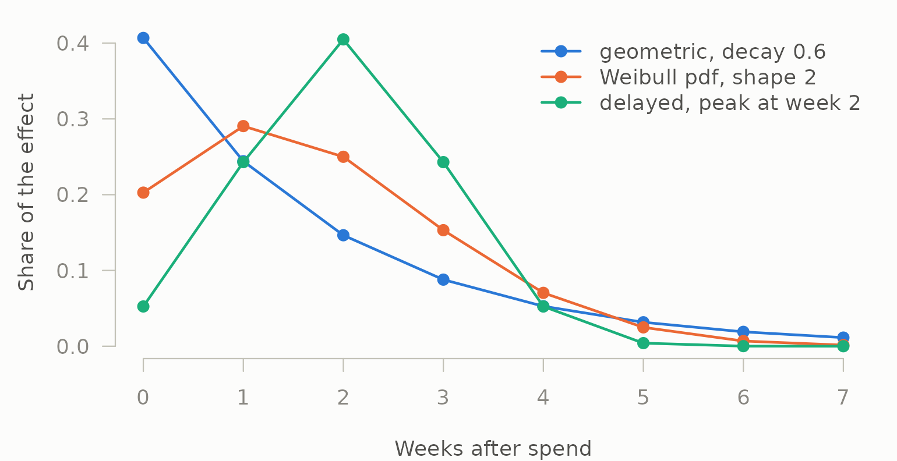
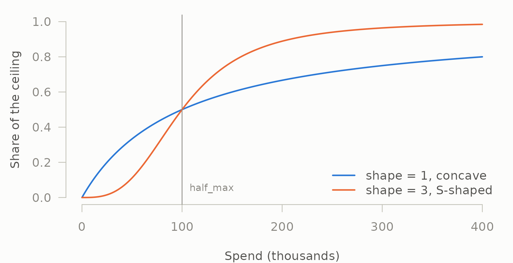
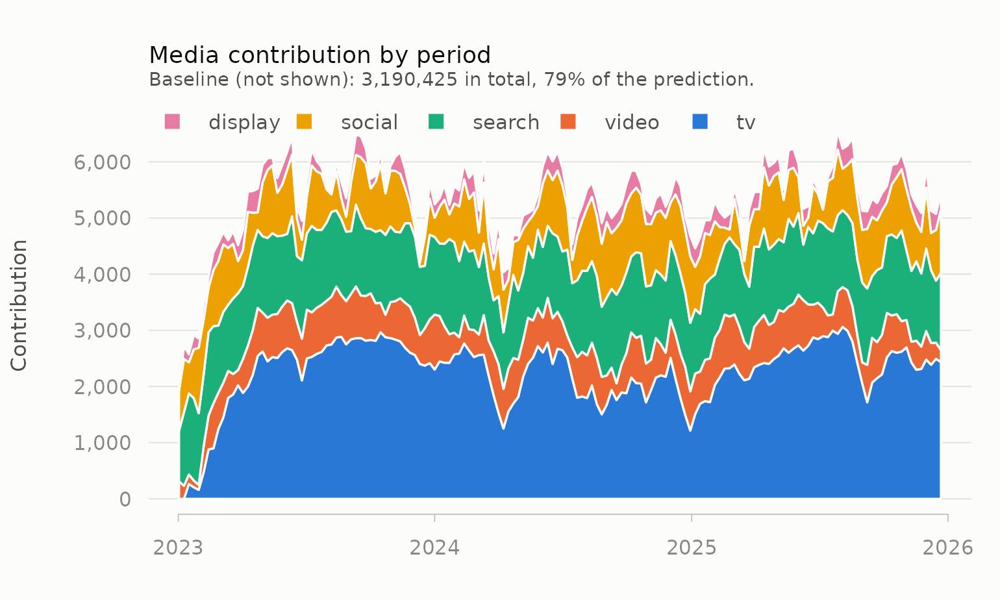
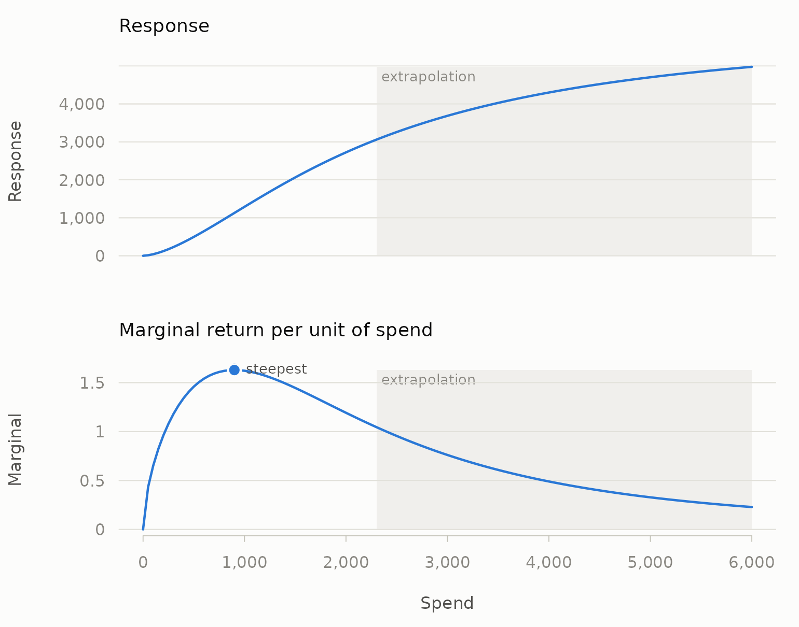

# Getting started

mediamix turns raw marketing data into model-ready features. It does two
things, and deliberately not a third: it converts media spend into
carryover- and saturation-adjusted regressors, and it converts raw event
logs into attributed customer journeys. It does not fit models.
[`lm()`](https://rdrr.io/r/stats/lm.html), `glmnet` and `brms` already
do that better than a marketing package would.

This vignette walks the whole arc on the media side: raw weekly spend,
through diagnostics and transforms, to a fitted model, contributions and
return on investment.

``` r

library(mediamix)
data(mm_weekly)

north <- mm_weekly[mm_weekly$geo == "north", ]
channels <- c("tv", "video", "search", "social", "display")
str(north[, c("date", channels, "price", "revenue")])
#> 'data.frame':    156 obs. of  8 variables:
#>  $ date   : Date, format: "2023-01-02" "2023-01-09" ...
#>  $ tv     : num  0 0 2193 0 0 ...
#>  $ video  : num  399 0 0 0 0 584 482 824 0 251 ...
#>  $ search : num  277 488 568 576 401 424 614 481 357 423 ...
#>  $ social : num  296 328 0 303 500 182 126 348 435 428 ...
#>  $ display: num  0 280 0 251 0 306 0 348 222 0 ...
#>  $ price  : num  22.1 25 25.3 25 26.8 ...
#>  $ revenue: num  27130 20433 20481 20565 17574 ...
```

## Look before you transform

Most marketing mix projects fail for reasons visible in the data before
any model is fitted.
[`diagnose_media()`](https://elkronos.github.io/mediamix/reference/diagnose_media.md)
runs those checks.

``` r

diagnose_media(mm_weekly, media = channels, by = "geo")
#> 
#> ── Media diagnostics
#> 468 observations across 3 series, 5 channels
#> ✔ No structural problems found.
#> 
#> Inspect $variation, $collinearity, $correlations.
```

Nothing structural is wrong here, which is what you would expect from
synthetic data. On real data this is where you learn that two channels
were planned together and their coefficients will therefore flip sign on
any small change to the specification. The detail is in the pieces:

``` r

d <- diagnose_media(mm_weekly, media = channels, by = "geo")
d$variation
#>   channel   mean    sd     cv distinct zero_share low_variation
#> 1      tv 1700.5 881.7 0.5096      131     0.1474         FALSE
#> 2   video  336.3 308.6 0.8939       84     0.4167         FALSE
#> 3  search  487.1 115.6 0.2286      118     0.0000         FALSE
#> 4  social  251.2 174.9 0.6613      101     0.2756         FALSE
#> 5 display  188.1 149.3 0.7584       88     0.3333         FALSE
#>   heavily_flighted usable
#> 1            FALSE   TRUE
#> 2            FALSE   TRUE
#> 3            FALSE   TRUE
#> 4            FALSE   TRUE
#> 5            FALSE   TRUE
```

Read `zero_share` as the worst geography’s dark-week rate, not an
overall average: with `by` supplied, every column here reports the worst
case across series, which is what you want from a diagnostic. `video`
goes dark in 42% of weeks in its worst geography and `display` in a
third. That is normal — media is flighted — but it means those channels
carry less information than 156 weeks per geography suggests.

## Carryover

Advertising does not stop working the week it runs. Adstock spreads each
period’s spend forward with geometric decay.

``` r

spend <- c(100, 0, 0, 0, 0, 0)
round(adstock_geometric(spend, decay = 0.5), 2)
#> [1] 50.00 25.00 12.50  6.25  3.12  1.56
```

Practitioners think in half-lives, not decay coefficients, so the
package provides the translation and uses it everywhere:

``` r

theta <- decay_from_half_life(3)   # a three-week half-life on weekly data
theta
#> [1] 0.7937
half_life(theta)
#> [1] 3
effective_window(theta, coverage = 0.90)
#> [1] 10
```

That last line says a three-week half-life still has 10% of its effect
outstanding after 10 weeks — which is how you decide whether truncating
the kernel costs you anything, and whether 156 weeks of data can
identify a carryover this long at all.

### Normalisation changes what your coefficient means

This is the argument that most often changes an answer without anyone
noticing, so it is explicit rather than implied.

``` r

constant <- rep(100, 50)
tail(adstock_geometric(constant, decay = 0.8), 1)                     # 100
#> [1] 100
tail(adstock_geometric(constant, decay = 0.8, normalise = FALSE), 1)  # 500
#> [1] 500
```

Normalised, the kernel sums to 1: a constant spend of 100 adstocks to
100, the series level is preserved, and the fitted coefficient reads as
the effect of *one unit of media*. Unnormalised — raw Koyck accumulation
— the same series accumulates to `100 / (1 - 0.8)`, and the coefficient
reads as the effect of one unit of *accumulated* media. Both are
defensible. Comparing a coefficient fitted one way against a coefficient
fitted the other is not.

mediamix defaults to normalised, as does the Bayesian MMM of Jin et al.
(2017). Robyn’s geometric adstock does not, so if you are reconciling
against Robyn, set `normalise = FALSE`.

### Dark weeks

Media data is full of zero-spend weeks, and carryover has to survive
them:

``` r

flighted <- c(100, 100, 0, 0, 0, 0, 100)
round(adstock_geometric(flighted, decay = 0.6), 2)
#> [1] 40.00 64.00 38.40 23.04 13.82  8.29 44.98
```

Carryover decays across the gap rather than resetting, and the new burst
adds to what is left.

### Delayed peaks

A geometric kernel always peaks in the period of spend. Television and
out-of-home routinely do not, and no decay rate fixes that. Weibull
adstock can:

``` r

w_geo <- adstock_weights(8, decay = 0.6)
w_wei <- adstock_weights_weibull(8, shape = 2, scale = 3, type = "pdf")
w_del <- adstock_weights_delayed(8, decay = 0.6, peak = 2)
round(rbind(geometric = w_geo, weibull = w_wei, delayed = w_del), 3)
#>            [,1]  [,2]  [,3]  [,4]  [,5]  [,6]  [,7]  [,8]
#> geometric 0.407 0.244 0.146 0.088 0.053 0.032 0.019 0.011
#> weibull   0.203 0.290 0.250 0.153 0.070 0.025 0.007 0.001
#> delayed   0.052 0.243 0.405 0.243 0.052 0.004 0.000 0.000
which.max(w_wei)
#> [1] 2
```

The delayed kernel of Jin et al. (2017) does the same with a `peak` read
directly in weeks. The three shapes side by side:

``` r

cols <- mm_palette(3)
ink <- mm_palette(role = "ink")
op <- par(mar = c(4, 4.5, 1, 1), bg = ink[["surface"]], fg = ink[["axis"]])
matplot(0:7, cbind(w_geo, w_wei, w_del), type = "o", pch = 19, lty = 1,
        lwd = 2, col = cols, xlab = "Weeks after spend",
        ylab = "Share of the effect", las = 1, bty = "n",
        col.axis = ink[["muted"]], col.lab = ink[["secondary"]])
legend("topright", c("geometric, decay 0.6", "Weibull pdf, shape 2",
                     "delayed, peak at week 2"),
       col = cols, lwd = 2, pch = 19, bty = "n", text.col = ink[["secondary"]])
```



``` r

par(op)
```

## Saturation

Adstock says *when* money works. Saturation says how hard it works at
the margin.

``` r

levels <- c(0, 25, 50, 100, 200, 400) * 1000
round(rbind(
  concave = saturate_hill(levels, half_max = 100000),
  s_shape = saturate_hill(levels, half_max = 100000, shape = 3)
), 3)
#>         [,1]  [,2]  [,3] [,4]  [,5]  [,6]
#> concave    0 0.200 0.333  0.5 0.667 0.800
#> s_shape    0 0.015 0.111  0.5 0.889 0.985
```

``` r

grid_spend <- seq(0, 400000, by = 2000)
op <- par(mar = c(4, 4.5, 1, 1), bg = ink[["surface"]], fg = ink[["axis"]])
plot(grid_spend / 1000, saturate_hill(grid_spend, half_max = 100000),
     type = "l", lwd = 2, col = cols[1], ylim = c(0, 1), las = 1, bty = "n",
     xlab = "Spend (thousands)", ylab = "Share of the ceiling",
     col.axis = ink[["muted"]], col.lab = ink[["secondary"]])
lines(grid_spend / 1000, saturate_hill(grid_spend, 100000, shape = 3),
      lwd = 2, col = cols[2])
abline(v = 100, col = ink[["muted"]])
text(100, 0.05, "half_max", pos = 4, cex = 0.8, col = ink[["muted"]])
legend("bottomright", c("shape = 1, concave", "shape = 3, S-shaped"),
       col = cols[1:2], lwd = 2, bty = "n", text.col = ink[["secondary"]])
```



``` r

par(op)
```

`half_max` is the spend at which the response reaches half its ceiling,
which is interpretable in the units you actually budget in. `shape > 1`
produces the threshold effect below which media barely registers.

## Composing them, in the right order

Saturation goes *after* adstock. Saturating first caps each period’s
spend in isolation and then lets carryover accumulate the capped values
past the ceiling, which defeats the point of having a ceiling.
[`media_transform()`](https://elkronos.github.io/mediamix/reference/media_transform.md)
composes them correctly and refuses to do it backwards quietly.

``` r

truth <- attr(mm_weekly, "truth")

transformed <- as.data.frame(Map(
  function(x, decay, half_max, shape) {
    media_transform(
      x,
      adstock = list(decay = decay),
      saturation = list(half_max = half_max, shape = shape)
    )
  },
  north[channels], truth$decay[channels],
  truth$half_max[channels], truth$shape[channels]
))
round(head(transformed, 4), 4)
#>       tv  video search social display
#> 1 0.0000 0.1663 0.3435 0.3175  0.0000
#> 2 0.0000 0.1225 0.5001 0.4202  0.2958
#> 3 0.0441 0.0890 0.5501 0.2459  0.1877
#> 4 0.0343 0.0640 0.5598 0.3838  0.3349
```

`mm_weekly` was generated from known parameters, attached as its
`"truth"` attribute, so here we can transform with the right ones. On
real data you do not know them — see
[`vignette("carryover")`](https://elkronos.github.io/mediamix/articles/carryover.md)
for how to choose them.

## Fit whatever model you like

mediamix stops here. The transformed columns are ordinary numeric
vectors:

``` r

model_data <- transformed
model_data$week <- seq_len(nrow(model_data))
model_data$price <- north$price
model_data$seasonality <- north$seasonality
model_data$holiday <- north$holiday

fit <- lm(north$revenue ~ ., data = model_data)
round(coef(fit)[channels])
#>      tv   video  search  social display 
#>    6013    1885    2622    2258     760
round(truth$beta[channels])
#>      tv   video  search  social display 
#>    5200    2400    4100    1800     900
```

Close, not exact — 156 weekly observations of flighted, partly collinear
media is a genuinely hard estimation problem, and pretending otherwise
is how marketing mix models acquire their reputation.

The controls are doing real work. Drop them and the media coefficients
absorb the trend and the price effect instead:

``` r

bare <- lm(north$revenue ~ ., data = transformed)
round(rbind(true = truth$beta[channels],
            with_controls = coef(fit)[channels],
            without = coef(bare)[channels]))
#>                 tv video search social display
#> true          5200  2400   4100   1800     900
#> with_controls 6013  1885   2622   2258     760
#> without       6110  1486   -218  -2067    2757
```

Two of the five turn negative, and `search` collapses from 2622 to -218.
Nothing about the transform changed; the specification did.

## Contributions and ROI

A marketing mix deliverable is not the coefficients. It is the
decomposition.

``` r

contrib <- contributions(transformed, fit, index = north$date)
round(tapply(contrib$contribution, contrib$channel, sum))
#> (baseline)    display     search     social         tv      video 
#>    3190425      40853     208307     132709     349629     102461
```

`"(baseline)"` is everything the model predicts that this decomposition
does not attribute to the supplied media — the intercept, the trend,
price, seasonality and the December uplift, pooled. It is *not* organic
demand, and reporting it as such is the commonest way one of these decks
overstates its own precision.

Over time, with the baseline left out so the media is visible:

``` r

plot(contrib)
```



The dip at the very start of 2023 is the cold start: television’s long
carryover takes weeks to fill from zero.
[`adstock_steady_state()`](https://elkronos.github.io/mediamix/reference/adstock_steady_state.md)
removes it when that matters — see
[`vignette("carryover")`](https://elkronos.github.io/mediamix/articles/carryover.md).

Pooling it that way is what makes the arithmetic close exactly:

``` r

totals <- as.numeric(tapply(contrib$contribution, contrib$period, sum))
all.equal(totals, unname(fitted(fit)))
#> [1] TRUE
```

Media accounts for about a fifth of predicted revenue here, which is a
plausible figure for a category with this much baseline:

``` r

media_share <- 1 - sum(contrib$contribution[contrib$channel == "(baseline)"]) /
  sum(contrib$contribution)
round(media_share, 3)
#> [1] 0.207
```

``` r

roi(contrib, north[channels])
#>   channel contribution  spend   roi
#> 1  social       132709  36716 3.614
#> 2  search       208307  74560 2.794
#> 3   video       102461  53248 1.924
#> 4 display        40853  26937 1.517
#> 5      tv       349629 266978 1.310
```

### Average and marginal return are different questions

Average ROI is a scorecard. Marginal ROI is the decision variable — what
the *next* pound returns — and it is the only one of the two that should
drive a reallocation.

The tempting shortcut is to differentiate the saturation curve at the
mean adstocked level and multiply by the kernel’s first weight,
`1 - decay`, on the grounds that a pound spent this week only adds that
much to this week’s adstock. It does — but it also adds to every later
week’s adstock, and under a normalised kernel those contributions sum to
the whole pound. The shortcut measures the return *inside the week of
spend* and ignores the rest, which for a slow channel is most of it.

[`marginal_roi()`](https://elkronos.github.io/mediamix/reference/marginal_roi.md)
avoids the calculus altogether. It re-runs the full transform on a
budget 1% larger in every week and divides the extra response by the
extra spend — the definition used by Jin et al. (2017) and by Meridian —
so carryover and flighting are both handled by construction, and the
result is a total over the same weeks as the average:

``` r

marginal <- do.call(rbind, lapply(channels, function(ch) {
  cbind(channel = ch, marginal_roi(
    north[[ch]], coefficient = coef(fit)[[ch]],
    adstock = list(decay = truth$decay[[ch]]),
    saturation = list(half_max = truth$half_max[[ch]],
                      shape = truth$shape[[ch]])
  ))
}))
marginal[, c("channel", "roi", "mroi")]
#>   channel   roi   mroi
#> 1      tv 1.310 1.2534
#> 2   video 1.924 1.1961
#> 3  search 2.794 1.3490
#> 4  social 3.614 2.0892
#> 5 display 1.517 0.9324
```

Compare the shortcut for television, whose decay of 0.85 means only 15%
of a week’s spend lands in that week’s adstock:

``` r

z_tv <- adstock_geometric(north$tv, decay = truth$decay[["tv"]])
shortcut <- mroi(mean(z_tv), coefficient = coef(fit)[["tv"]],
                 half_max = truth$half_max[["tv"]],
                 shape = truth$shape[["tv"]]) * (1 - truth$decay[["tv"]])
c(shortcut = shortcut, simulated = marginal$mroi[marginal$channel == "tv"])
#>  shortcut simulated 
#>    0.2059    1.2534
```

The shortcut understates television’s marginal return about six-fold,
and a reallocation built on it would strip budget from exactly the
channel whose effect arrives late.

Read the simulated column instead. Display’s average pound returns about
1.5, but its *next* pound returns less than it costs: it is over-funded,
and the average-ROI table hides that completely. Search and social have
average returns roughly double their marginal ones — concave curves,
well up the slope. Television is the odd one out: its marginal return is
close to its average, because its S-shaped curve (`shape = 1.6`) is
still near its steepest section at this budget. Under a concave curve
marginal is below average everywhere; under an S-curve it can be close
to or even above it below the inflection point, and assuming otherwise
is how a threshold channel stays starved.

The full curve, and its inverse:

``` r

curve <- response_curve(
  spend = seq(0, 6000, by = 1000),
  coefficient = coef(fit)[["tv"]],
  half_max = truth$half_max[["tv"]], shape = truth$shape[["tv"]]
)
curve
#>   spend response  marginal
#> 1     0        0 7.708e-05
#> 2  1000     1290 1.621e+00
#> 3  2000     2724 1.192e+00
#> 4  3000     3686 7.607e-01
#> 5  4000     4300 4.900e-01
#> 6  5000     4702 3.280e-01
#> 7  6000     4977 2.287e-01

fine <- response_curve(seq(0, 6000, by = 50), coefficient = coef(fit)[["tv"]],
                       half_max = truth$half_max[["tv"]],
                       shape = truth$shape[["tv"]])
plot(fine, observed = adstock_geometric(north$tv, truth$decay[["tv"]]))
```



``` r


spend_for(target = 3000, coefficient = coef(fit)[["tv"]],
          half_max = truth$half_max[["tv"]], shape = truth$shape[["tv"]])
#> [1] 2244
```

These describe the curve the model fitted, which is not the same as what
would happen if you actually spent that much. The curve is identified
only over the range of spend the data contains; anything beyond it is
extrapolation wearing a decimal point.

## Where next

- [`vignette("carryover")`](https://elkronos.github.io/mediamix/articles/carryover.md)
  — choosing decay and lag by cross-validation against your KPI rather
  than by eye.
- [`vignette("journeys")`](https://elkronos.github.io/mediamix/articles/journeys.md)
  — the attribution half: building customer journeys from raw event
  logs.
- [`vignette("tidymodels")`](https://elkronos.github.io/mediamix/articles/tidymodels.md)
  — tuning carryover, saturation and model penalty jointly.
- [`vignette("spine")`](https://elkronos.github.io/mediamix/articles/spine.md)
  — why carryover and credit are the same idea.

## References

Jin, Y., Wang, Y., Sun, Y., Chan, D. and Koehler, J. (2017). *Bayesian
methods for media mix modeling with carryover and shape effects.* Google
Inc.
