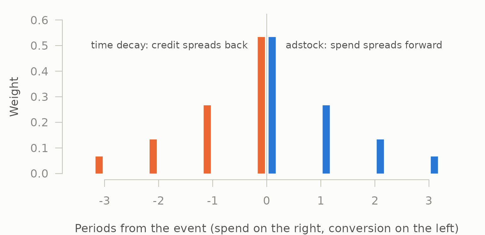

# Carryover and credit are the same idea

mediamix does two things that look unrelated. It adstocks media spend,
which is a marketing mix modelling concern. It assigns credit across
customer journeys, which is a multi-touch attribution concern. These
live in different teams, different literatures and usually different
packages.

They are the same operation run in opposite directions.

``` r

library(mediamix)
```

## Forward: one impulse of spend

Adstock takes a single burst of media and spreads its effect forward
through time with geometric decay:

``` r

burst <- c(100, 0, 0, 0, 0, 0)
round(adstock_geometric(burst, decay = 0.5, normalise = FALSE), 2)
#> [1] 100.00  50.00  25.00  12.50   6.25   3.12
```

100, 50, 25, 12.5 — each period retains half of the last. The kernel is
$`\theta^i`$ at lag $`i`$.

## Backward: one conversion

Time-decay attribution takes a single conversion and spreads its credit
backward across the touchpoints that preceded it, with geometric decay:

``` r

journey <- data.frame(
  cust = "a",
  channel = c("display", "social", "email", "paid_search"),
  ts = as.POSIXct("2026-01-01", tz = "UTC") + c(0, 1, 2, 3) * 86400,
  conv = c(0, 0, 0, 1)
)
paths <- build_paths(journey, id = "cust", channel = "channel",
                     timestamp = "ts", conversion = "conv")

td <- credit_time_decay(paths, decay = 0.5)
td[, c("channel", "time_to_conversion", "credit")]
#>       channel time_to_conversion  credit
#> 1     display                  3 0.06667
#> 2      social                  2 0.13333
#> 3       email                  1 0.26667
#> 4 paid_search                  0 0.53333
```

The touch at the moment of conversion gets the most, the one a day
earlier half as much, and so on backward. Same kernel, opposite arrow.

## The same numbers

Line them up. Normalise the adstock kernel so both sum to 1, and reverse
the credit vector so both run from “closest to the event” outward:

``` r

forward <- adstock_weights(max_lag = 4, decay = 0.5)
backward <- rev(td$credit)

round(rbind(forward = forward, backward = backward), 6)
#>            [,1]   [,2]   [,3]    [,4]
#> forward  0.5333 0.2667 0.1333 0.06667
#> backward 0.5333 0.2667 0.1333 0.06667
all.equal(forward, backward)
#> [1] TRUE
```

Identical. Not analogous — identical. Drawn on one time axis, with the
event at zero, the two are mirror images:

``` r

ink <- mm_palette(role = "ink")
cols <- mm_palette(2)
op <- par(mar = c(4, 4.5, 1, 1), bg = ink[["surface"]], fg = ink[["axis"]])
plot(NA, xlim = c(-3.5, 3.5), ylim = c(0, 0.6), las = 1, bty = "n",
     xlab = "Periods from the event (spend on the right, conversion on the left)",
     ylab = "Weight", col.axis = ink[["muted"]], col.lab = ink[["secondary"]])
abline(v = 0, col = ink[["axis"]])
# Offset each side slightly so the two bars at the event itself both show.
segments(0:3 + 0.1, 0, 0:3 + 0.1, forward, lwd = 10, lend = 1, col = cols[1])
segments(-(0:3) - 0.1, 0, -(0:3) - 0.1, backward, lwd = 10, lend = 1,
         col = cols[2])
text(1.8, 0.5, "adstock: spend spreads forward", col = ink[["secondary"]],
     cex = 0.85)
text(-1.8, 0.5, "time decay: credit spreads back", col = ink[["secondary"]],
     cex = 0.85)
```



``` r

par(op)
```

The reason is that both are the geometric kernel $`\theta^{d}`$
evaluated at a distance $`d`$ from an event, normalised over the periods
in scope. Adstock measures $`d`$ as *time since the spend*, running
forward. Time-decay credit measures $`d`$ as *time until the
conversion*, running backward. Change the sign of the distance and one
becomes the other.

``` math
\text{adstock}: \quad w_i \propto \theta^{\,t_i - t_{\text{spend}}}
\qquad\qquad
\text{credit}: \quad w_i \propto \theta^{\,t_{\text{conv}} - t_i}
```

## Why this is in the API rather than a footnote

Because it means there is one vocabulary rather than two, and
practitioners already have that vocabulary: they say “television works
for about three weeks”, not “television has a decay coefficient of
0.79”.

``` r

theta <- decay_from_half_life(3)
theta
#> [1] 0.7937

# Forward
round(adstock_geometric(c(1000, 0, 0, 0, 0), decay = theta), 2)
#> [1] 206.30 163.74 129.96 103.15  81.87

# Backward, same argument, same meaning
round(credit_time_decay(paths, decay = theta)$credit, 4)
#> [1] 0.1710 0.2155 0.2715 0.3420
```

[`decay_from_half_life()`](https://elkronos.github.io/mediamix/reference/decay_vocabulary.md),
[`half_life()`](https://elkronos.github.io/mediamix/reference/decay_vocabulary.md)
and
[`effective_window()`](https://elkronos.github.io/mediamix/reference/decay_vocabulary.md)
serve both halves of the package because there is only one kernel to
describe, so a half-life means the same thing wherever it appears, and
[`effective_window()`](https://elkronos.github.io/mediamix/reference/decay_vocabulary.md)
converts either kind into a window length.

Sharing the vocabulary is not the same as sharing the *value*, though. A
three-week television half-life estimated from weekly sales describes
how aggregate demand responds to aggregate spend. A time-decay half-life
on a journey describes how a convention weights one customer’s clicks
against each other, usually over days. There is no reason for the two
numbers to agree, and an MMM half-life is not by itself a defensible
attribution lookback — read that off the journeys with
[`conversion_lag()`](https://elkronos.github.io/mediamix/reference/conversion_lag.md)
instead.

## What the symmetry does not give you

It is a symmetry of *arithmetic*, not of evidence.

Adstock is a claim about a causal mechanism: money spent in week one
still moves sales in week three, and a regression on adstocked spend
estimates how much. It can be wrong, and it is testable — the transform
either improves out-of-sample prediction of the KPI or it does not,
which is exactly what
[`tune_carryover()`](https://elkronos.github.io/mediamix/reference/tune_carryover.md)
measures.

Time-decay credit is a claim about nothing. It is a convention for
dividing an observed conversion among observed touchpoints. Recency is a
reasonable basis for that convention and there is no experiment that
could confirm it, because the quantity it estimates does not exist
independently of the rule. Running the same kernel backward does not
import adstock’s evidential status into attribution.

Keeping both halves in one package makes the shared arithmetic visible,
and that is worth doing. It should not be allowed to blur the difference
between a mechanism and a bookkeeping choice.

## Where the symmetry stops

It holds exactly for the geometric kernel on evenly spaced touches. It
stops being exact in three ordinary situations, all of which are the
attribution side’s problem rather than the transform side’s:

- **Uneven spacing.** Adstock operates on a regular series by
  construction. Touchpoints arrive whenever they arrive, so
  [`credit_time_decay()`](https://elkronos.github.io/mediamix/reference/credit.md)
  evaluates the kernel at the actual elapsed time rather than at an
  integer lag.
- **Truncation.** Adstock’s kernel is normalised over `max_lag` periods;
  credit is normalised over however many touches a journey happens to
  contain.
- **Non-geometric kernels.**
  [`adstock_weibull()`](https://elkronos.github.io/mediamix/reference/adstock_weibull.md)
  has no attribution counterpart in this package. It could have one —
  [`credit_custom()`](https://elkronos.github.io/mediamix/reference/credit.md)
  takes an arbitrary function of rank, journey length and recency — but
  a delayed-peak credit rule would be asserting that touches from a
  fortnight ago deserve more credit than yesterday’s, and that is a
  strange thing to assert without evidence.

``` r

# A Weibull-shaped credit rule, if you wanted one. The peak falls two days
# before the conversion, so the closing touch gets almost nothing.
weibull_credit <- credit_custom(paths, function(rank, n, recency) {
  dweibull(recency + 0.5, shape = 3, scale = 2.5)
})
weibull_credit[, c("channel", "time_to_conversion", "credit")]
#>       channel time_to_conversion  credit
#> 1     display                  3 0.15304
#> 2      social                  2 0.44663
#> 3       email                  1 0.35216
#> 4 paid_search                  0 0.04818
```

The hook is there, and it does what a delayed-peak kernel should: the
touch two days out receives the most credit and the one at the moment of
conversion receives 5%. Whether that number means anything is a separate
question, and the honest answer is usually no — a rule asserting that a
touch from two days ago deserves nine times the credit of the click that
closed the sale is a claim about causation, made without evidence,
dressed as a convention.
